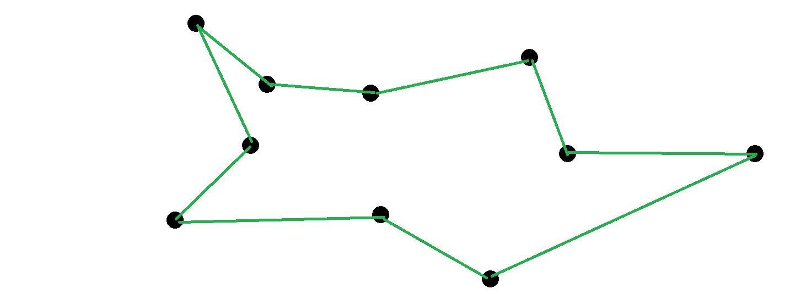

# Data Engineer test

### Read before starting

The following test aims to help you to show us your qualities as Data Engineer. 
You are expected to be able to code, interact with data from an external API and create an industrialized a data pipeline. As a Data Engineer you will also show your knowledge about Data/Software technologies.

* What we **do expect** from you: 
    - You show your best skills, and you answer every question.
    - Explaining how, what and why you will do something is as important as coding. Diagrams and schemas will weight as functions and methods.
    - If you arrived here, you know about *craftmanship* ;) do not forget it when coding.
    - Developing dummy functions documented and easy to feature is normal. Do not hesitate to use them.

* What we **do not** expect:
    - That you spend too much time in it, it's thought to be finish in around 2/3 hours maybe some more. Organize yourself as you will if you come with us. You can spend more or less time, (if you add time, keep it reasonable).
    - You get an awful moment taking the test.

* What's **a bonus**:
    - Your code is tested with a hight coverage (>80%).
    - The application you wrote works properly.
    - The explanation of the architecture/technology is not only answered but also highly detailed for each expected point: 
        SPOFs if any, future problems, budget, maintenance, technical debt, devOps tecnhiques.
    - Even if you show your knowledge with other technologies, your answers are adapted to Google Cloud Platform.
 
## Context
A new international partner in IoT gives us the measures of temperatures coming from their sensors. 
We can access their measures using the following (dummy) API. 
 
``` 
curl -H "X-API-Key: dd764f40" https://my.api.mockaroo.com/sensor/temperatures
``` 
 
This Rest API will send you back a json with the following schema:

```
[
  {
    "id": "1b16b092-e8e8-490b-a9be-0db1580fb164", // An unique id 
        "timestamp": "2019-02-19 14:02:10", // the timestamp at which the record was taken
        "lat": 45.6258385, // latitude
        "lon": 0.0629891, // longitude
        "temperature": 29.4068, // the temperature value
        "country": "France" // the country
  }
]
```
 
Every record contains the temperature at the moment you call the API. If you call the API twice you will then get different results.
 
***Our objective is to find out the mean temperature for every region in France.***/
 
The following link will give the coordinates of the frontier for each region.
 
```
https://datanova.laposte.fr/explore/dataset/contours-geographiques-des-nouvelles-regions-metropole/table/ 
```
Let's assume that a measured temperature is in a region if it's inside of the polygon designed by the data above.

Once you aggregate the data, you can send the results to one of our RDBM database. We will provide you with the credentials and info.
 
** We expect to find at least one table in this database that satisfies the following schema:**
 
 * hour (the time at the import was started)
 * region
 * temperature
 * numberOfPoints (the number of points used to compute the mean temperature)

#### (Hint) Region definition

The preceeding link provides us with a list of cities with their associated region. However, to perform the matchin, we need to get the GPS coordinates of every region. In order to ease the test, we are going to assume that regions are rectangles. Even though this does not make any sense in the real world, this is a shortcut to make your life easier ;)

If we call `E` the list of cities and their GPS points for a region, then we define the bounding box for the region as : 
``` 
R = ( { min(latitude) in E, min(longitude) in E } ; { max(latitude) in E, max(longitude) in E } )
```

For instance, if for a given region, we get the following list of GPS coordinates:



Then we define the associated region as:


## SQL
 
Once we get all your data set up, *we would like you to write a SQL query that gives us the following information: for every region and every hour, we want the temperature at this hour and also the temperature 3 hours before.*
 
The dataset should then look like :
 
| Region  | Hour  | Temperature  | Temperature3HoursBefore  |
|---|---|---|---|
| ...  | ...  | ...  |  ... |
 
## Architecture plan. 

Now you should write a plan explaining the following points. The goal here is not to develop anything but rather explain your ideal solution:

* *If you were to develop the same application where the temperatures dataset grow by 1Go per minute, what would you do differently?* 

* *If our data source was to emit multiple versions (corrections for instance) of the same data, what could be the different applicable strategies?*

* *What infrastructure, products, workflow scheduler, would you use to make sure the whole pipeline runs fine in production?*

* *Some months later, we think to apply another aggregation/model to the input data. How would your architecture evolve to integrate this challenge?*


# Key Points
 
The key points we will be looking at are:
 
    * Architecture and design.
    * Code quality.
    * Test
    * Tech choices.
    * Scalability
    * Error Handling
    * Backup
    * Continuous integration
    * Versioning
